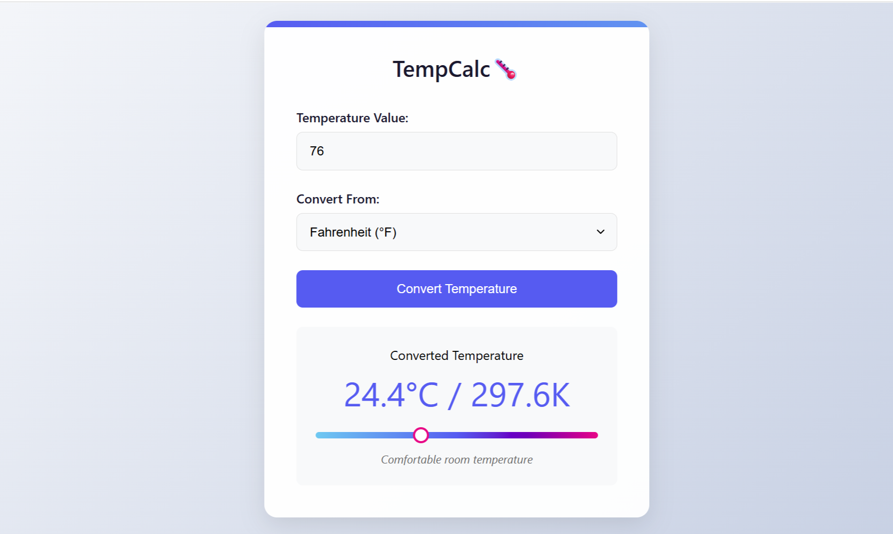

# OIBSIP_Level1_Task3
# 🌡️ TempCalc

**TempCalc** is a responsive, user-friendly temperature converter web application built using **HTML**, **CSS**, and **JavaScript**. It allows users to convert temperatures between **Celsius**, **Fahrenheit**, and **Kelvin**, and provides a visual indicator and description of the temperature.

---

## 🚀 Features

- 🎨 Modern and responsive card-based UI design
- 📈 Visual temperature scale indicator
- 🔁 Convert between Celsius, Fahrenheit, and Kelvin
- 💡 Temperature context comparison (e.g., "Cool spring-like temperature")
- ⚠️ Input validation with error messages
- 🖱️ Convert on button click or Enter key

## 🧠 Conversion Logic

- **Celsius → Fahrenheit & Kelvin**
- **Fahrenheit → Celsius & Kelvin**
- **Kelvin → Celsius & Fahrenheit**
- Conversion output is limited to **1 decimal place** for readability.

## 💡CSS3

- Fully responsive on small screens (mobile-first design).
- Visual scale adjusts position of the indicator dynamically.
- Semantic code with accessibility-friendly form labeling.

## 🖼️ Preview

> 

